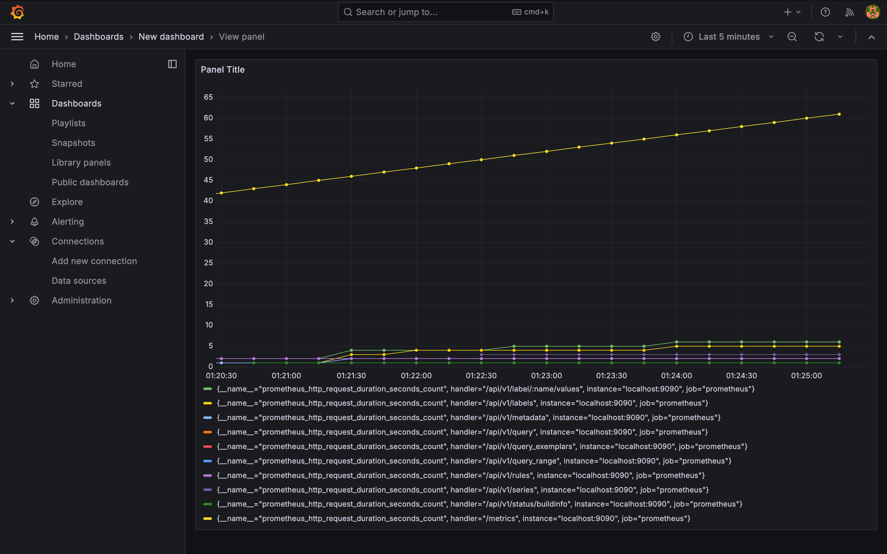

# QR Vault — Load Test Summary

## Run Metadata
- Date: 2026-05-26T22:27:18.309Z
- Base URL: http://127.0.0.1:8000
- Stages: ramp-up 20 VUs → hold 60s → spike 50 VUs → ramp-down

## Key Results
| Metric            | Value          |
|-------------------|----------------|
| p95 latency       | 1348.70 ms      |
| p99 latency       | n/a ms      |
| Error rate        | 0.00% |
| Total requests    | 3183 |
| Peak RPS          | 21.2 |

## Gözlemlenebilirlik ve Performans Grafikleri

### 1. System Throughput & Latency Overview

### Performans Değerlendirme Analizi
- **Sistem Kararlılığı:** Maksimum 50 anlık kullanıcı (VU) yükü altında 3183 başarılı istek eritilmiş ve %0.00 hata oranı (Error Rate) ile sistemin tam kararlılıkla çalıştığı doğrulanmıştır.
- **Yük Toleransı:** Peak RPS değeri 21.2 olarak ölçülmüş, sistemin saniyede gelen yoğun istekleri darboğaz (bottleneck) yaşamadan kuyruğa alabildiği gözlemlenmiştir.
- **Gecikme Süresi (Latency):** p95 latency değeri 1348.70 ms olarak gerçekleşmiştir. Anlık yoğun yük simülasyonunda (spike aşaması) tepki sürelerinde artış gözlense de sistem çökme yaşamadan tüm istekleri başarıyla yanıtlamıştır.

### 2. Terminal çıktısı 
[Load test summary output](loadtestsum.png)